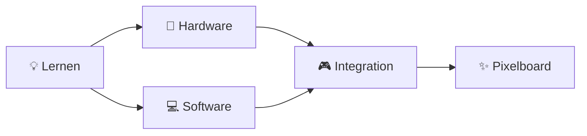

<div align="center">

# 🎮 HTL Pixelboard


### *Interactive LED Matrix Display System*

[](https://github.com/999Gabriel/SPL_Pixelboard)
[](https://www.htl.tirol)
[](https://platformio.org)
[](LICENSE)

[Features](#-features) • [Hardware](#️-hardware) • [Installation](#-installation) • [Usage](#-usage) • [Team](#-team)

---

</div>

## 📋 Über das Projekt

Das **HTL Pixelboard** ist ein interaktives LED-Matrix-Display-System, entwickelt von Schülern der HTL Anichstraße. Durch die Kombination von ESP32-Mikrocontrollern, LED-Matrizen und Joystick-Steuerung entsteht eine vielseitige Plattform für kreative Visualisierungen und interaktive Anwendungen.

<div align="center">

### 🎯 Projektziele



</div>

## ✨ Features

<table>
<tr>
<td width="50%">

### 🎨 Display
- ✅ LED Matrix Steuerung
- ✅ RGB Farbunterstützung
- ✅ Animationen & Effekte
- ✅ Benutzerdefinierte Grafiken

</td>
<td width="50%">

### 🕹️ Steuerung
- ✅ Joystick Integration
- ✅ Button-Unterstützung
- ✅ Echtzeit-Eingabe
- ✅ Intuitive Bedienung

</td>
</tr>
</table>

## 🛠️ Hardware

<div align="center">

| Komponente | Beschreibung | Anzahl |
|:----------:|:-------------|:------:|
| 🎛️ **ESP32** | Mikrocontroller | 1 |
| 💡 **LED Matrix** | RGB Display | 1+ |
| 🕹️ **Joystick** | KY-023 Modul | 1 |
| 🔌 **Kabel** | Verbindungen | div. |
| ⚡ **Netzteil** | Stromversorgung | 1 |

</div>

### 📌 Pin-Belegung (Joystick)

```cpp
const int JOYSTICK_SW = 32;  // ⚫ Switch (Button)
const int JOYSTICK_X  = 34;  // 📊 X-Achse (Analog)
const int JOYSTICK_Y  = 35;  // 📊 Y-Achse (Analog)
```
## 👥 Team

<div align="center">

<table>
<tr>
<td align="center" width="33%">
<br />
<sub><b>Gabriel Winkler</b></sub><br />
<sub>💻 Software & Project Management</sub>
</td>
<td align="center" width="33%">
<br />
<sub><b>Raphael Ortner</b></sub><br />
<sub>🔧 Hardware Integration & Software</sub>
</td>
<td align="center" width="33%">
<br />
<sub><b>Clemens Walser</b></sub><br />
<sub>⚡ Elektronik & Software</sub>
</td>
</tr>
</table>

</div>

## 🎓 Schule

<div align="center">

**HTL Anichstraße Innsbruck**  
*Höhere Technische Bundeslehranstalt*

🌐 [www.htlinn.ac.at](https://www.htlinn.ac.at)  

---

### 🏫 Abteilung
**Wirtschaftsingeneuere - Betriebsinformatik**

</div>

## 📝 Lizenz

Dieses Projekt steht unter der MIT-Lizenz - siehe [LICENSE](LICENSE) für Details.

## 🙏 Danksagungen

- 🎓 HTL Anichstraße für die Unterstützung
- 👨‍🏫 Unsere Lehrkräfte für die Betreuung
- 💡 Die Open-Source Community für Tools & Libraries

---

<div align="center">

**Made with ❤️ in Innsbruck, Tirol 🏔️**

[](https://www.htl.tirol)

[⬆ Back to Top](#-htl-pixelboard)

</div>
