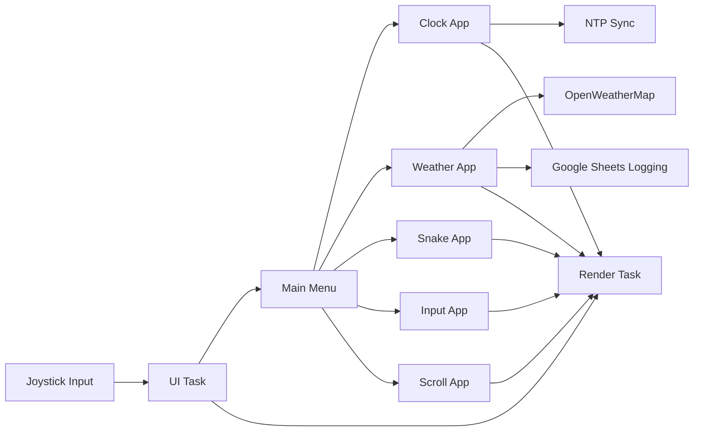

<div align="center">

# 🎮 HTL Pixelboard


### *Unified ESP32 Pixelboard System with PlatformIO + FreeRTOS*

[](https://www.htl.tirol)
[](https://platformio.org)
[](https://www.freertos.org/)
[](https://openweathermap.org/)
[](https://www.google.com/sheets/about/)
[](LICENSE)

[Status](#-current-status) • [Features](#-features) • [Hardware](#️-hardware) • [Project Structure](#-project-structure) • [Build](#-build--flash) • [Team](#-team)

---

</div>

## 📋 Über das Projekt

Das **HTL Pixelboard** ist ein interaktives 32x16 LED-Matrix-System auf ESP32-Basis. Der aktuelle Hauptstand vereint die vorher getrennten Prototypen in **einem** zentralen PlatformIO-Projekt mit **FreeRTOS-Tasks**, einem sichtbaren Hauptmenü auf dem Panel und klarer Hardware-/Software-Struktur.

Die Unified-Version konzentriert sich auf einen sauberen produktiven Kern:

- ein gemeinsamer `main.cpp` als Einstiegspunkt
- ein Menü direkt auf dem Pixelboard
- Uhrzeit via NTP
- Wetterdaten via OpenWeatherMap
- Logging der Wetterdaten nach Google Sheets
- Snake-Spiel
- Input-/Joystick-Diagnose
- Serial-Logging für Debugging und Runtime-Status

<div align="center">

### 🧭 Systemübersicht


```mermaid
graph LR
    A[Joystick Input] --> B[UI Task]
    B --> C[Main Menu]
    C --> D[Clock App]
    C --> E[Weather App]
    C --> F[Snake App]
    C --> G[Input App]
    C --> H[Scroll App]
    D --> I[NTP Sync]
    E --> J[OpenWeatherMap]
    E --> K[Google Sheets Logging]
    B --> L[Render Task]
    D --> L
    E --> L
    F --> L
    G --> L
    H --> L
```

</div>

## 🚦 Current Status

<table>
<tr>
<td width="50%">

### ✅ Hauptprojekt
- Unified Codebase vorhanden
- PlatformIO-Projekt eingerichtet
- Build erfolgreich geprüft
- Menü auf dem Pixelboard integriert

</td>
<td width="50%">

### ✅ Laufende Funktionen
- WiFi-Verbindung
- NTP-Uhr
- Wetter-API
- Google-Sheets-Logging
- Snake
- Serial-Debug-Logging

</td>
</tr>
</table>

Der aktive Hauptcode liegt in:

```text
Code/PixelBoardUnified
```

## ✨ Features

<table>
<tr>
<td width="33%">

### 🖥️ Display
- 32x16 Dual-Panel Rendering
- eigenes Panel-Mapping
- zentrales Menüsystem
- lesbare 5x7 Pixel-Font

</td>
<td width="33%">

### 🌐 Daten & Logging
- OpenWeatherMap Integration
- NTP-Zeitsynchronisation
- Google Sheets Logging
- Serial Runtime Logs

</td>
<td width="33%">

### 🎮 Interaktivität
- Joystick-Navigation
- kurzer/langer Tastendruck
- Snake als App
- Input-Diagnose-Ansicht

</td>
</tr>
</table>

## 🛠️ Hardware

<div align="center">

| Komponente | Beschreibung | Anzahl |
|:----------:|:-------------|:------:|
| 🎛️ **ESP32 Dev Module** | Hauptcontroller | 1 |
| 💡 **WS2812B Panels** | Zwei 8x32 Panels, kombiniert zu 32x16 | 2 |
| 🕹️ **Joystick** | Analogstick mit Taster | 1 |
| ⚡ **5V Versorgung** | Externe Stromversorgung für LEDs | 1 |

</div>

### 📌 Pin-Belegung

```cpp
// LED panels
GPIO 25 -> upper data line
GPIO 26 -> lower data line

// Joystick
GPIO 32 -> button
GPIO 34 -> X axis
GPIO 35 -> Y axis
```

## 🧱 Project Structure

```text
SPL_Pixelboard/
├── README.md
└── Code/
    ├── PixelBoardUnified/        # maintained main project
    │   ├── platformio.ini
    │   ├── src/main.cpp
    │   └── include/
    │       ├── secrets.h
    │       └── secrets.example.h
    ├── WeatherAPI_PixelBoard/    # older reference version
    ├── Pixelboard/               # older experimental code
    ├── Zeit_anzeigen/            # older menu/time experiments
    ├── Snake/                    # standalone snake prototype
    └── joystick_test/            # joystick test project
```

## 🧠 Unified Architecture

Die aktuelle Unified-Version verwendet FreeRTOS-Tasks für getrennte Verantwortlichkeiten:

- `InputTask`: liest Joystick und Button
- `UiTask`: Menülogik und App-Wechsel
- `WeatherTask`: WiFi, NTP, Wetterdaten, Google-Sheets-Logging
- `SnakeTask`: Spiellogik
- `ScrollTask`: Laufschrift
- `RenderTask`: finale Anzeige auf der Matrix

Damit ist die bisher verteilte Logik aus mehreren Projekten in einem konsistenten Runtime-Modell zusammengeführt.

## 🚀 Build & Flash

Wechsle in das Hauptprojekt:

```bash
cd Code/PixelBoardUnified
```

Build:

```bash
pio run -e esp32dev
```

Upload:

```bash
pio run -e esp32dev --target upload
```

Serial Monitor:

```bash
pio device monitor -b 115200
```

## 🔐 Konfiguration

Die produktive Konfiguration liegt in:

```text
Code/PixelBoardUnified/include/secrets.h
```

Vorlage:

```text
Code/PixelBoardUnified/include/secrets.example.h
```

Dort werden aktuell konfiguriert:

- `WIFI_SSID`
- `WIFI_PASSWORD`
- `WEATHER_API_KEY`
- `WEATHER_CITY`
- `GOOGLE_SCRIPT_URL`

## 🎮 Bedienung

### Im Menü
- Joystick hoch/runter: zwischen Apps wechseln
- kurzer Tastendruck: App öffnen

### In Apps
- langer Tastendruck: zurück ins Menü

### In Snake
- Joystick steuert die Richtung
- kurzer Tastendruck startet nach Game Over neu

## 🧪 Debugging

Der Unified-Main loggt wichtige Laufzeitinformationen in den Serial Monitor:

- Boot-Konfiguration
- WiFi-Verbindungsstatus
- NTP-Synchronisation
- Wetter-Requests und Fehler
- Google-Sheets-Logging
- App-Wechsel

Das erleichtert Fehlersuche direkt auf dem ESP32 erheblich.

## 👥 Team

<div align="center">

<table>
<tr>
<td align="center" width="33%">
<br />
<sub><b>Gabriel Winkler</b></sub><br />
<sub>💻 Software & Project Management</sub>
</td>
<td align="center" width="33%">
<br />
<sub><b>Raphael Ortner</b></sub><br />
<sub>🔧 Hardware Integration & Software</sub>
</td>
<td align="center" width="33%">
<br />
<sub><b>Clemens Walser</b></sub><br />
<sub>⚡ Elektronik & Software</sub>
</td>
</tr>
</table>

</div>

## 🎓 Schule

<div align="center">

**HTL Anichstraße Innsbruck**  
*Höhere Technische Bundeslehranstalt*

🌐 [www.htl.tirol](https://www.htlinn.ac.at)

### Abteilung
**Wirtschaftsingenieure – Betriebsinformatik**

</div>

## 📝 Lizenz

Dieses Projekt steht unter der MIT-Lizenz. Details siehe [LICENSE](LICENSE).

---

<div align="center">

**Built in Innsbruck with ESP32, LEDs and too many experiments that finally became one clean project.**

[⬆ Back to Top](#-htl-pixelboard)

</div>
